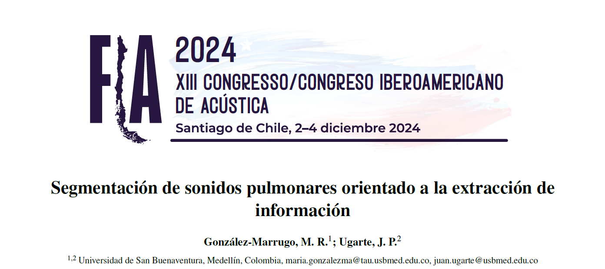

  

# Hi, I'm María 👋

Sound Engineer with a background in computer science, acoustics and signal processing.  
Currently pursuing a **Specialization in Data Science and Artificial Intelligence** at the **University of Medellín (UDEM)**.

I’m interested in modeling real-world phenomena using computational tools, especially in **business and process data**, as well as **acoustic and biomedical signal analysis**.  

I enjoy applying **data science, machine learning, and mathematical modeling** to transform data into insights and practical solutions.

---

# 🔬 What I Do

- Data Analysis  
- Statistical Analysis  
- Machine Learning Applications  
- Signal Processing & Computational Acoustics  
- Modeling Real-World Phenomena with Computational Tools  

---

# 🧠 Skills

**Programming**

- Python  
- SQL  
- MATLAB  

**Data Science**

- Data Analysis  
- Statistical Analysis  
- Machine Learning  

---

<h1>📊 Projects</h1>

Here you will find projects related to:

<ul>
<li>Data analysis and machine learning</li>
<li>Signal processing and computational modeling</li>
<li>Applied data science projects</li>
</ul>

 

<table>
<tr>

<td width="50%" valign="top">

<h3>🎓 Undergraduate Thesis – Research Paper</h3>

<strong>Paper:</strong> Segmentation of Lung Sounds for Information Extraction

<strong>Description:</strong> 
This work presents the research developed during my undergraduate thesis.  
It focuses on applying computational and data-driven techniques to analyze and model complex signals and datasets.

📄 <a href="Thesis_Paper.pdf">Read the paper</a>

</td>

<td width="50%" valign="top">

<h3>🐦 Bird Song Classification</h3>

<strong>Description:</strong> 
Multiclass classification project for bird songs using spectral features extracted from labeled audio recordings. The project builds a data processing and machine learning pipeline to identify bird species based on their vocalizations.

🔗 <a href="https://github.com/mdelrosariogm/Bird_Song_Classification">View repository</a>

</td>

</tr>
</table>

***(More projects coming soon 🚀)***

---

# 🌎 Contact

📍 Medellín, Colombia  

📧 **Email:**  
mrgm2711@gmail.com  

💼 **LinkedIn:**  
[linkedin.com/in/gonzalez-marrugo-maria](https://www.linkedin.com/in/gonzalez-marrugo-maria/)
